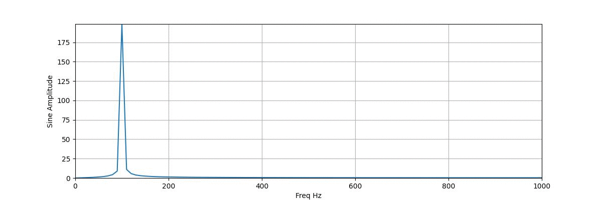

## spectrum plot

### plotting FFT of 1D data, with live plot update

usage example:
```
    import numpy as np
    from spectrum_plot import create_fft_plot
    
    
    plot = create_fft_plot()
    n = 200
    seconds = 0.1
    t = np.linspace(0, seconds, n)
    nyquist = n / seconds / 2
    for freq in np.linspace(100, nyquist, 100):
        sine = np.sin(2 * np.pi * t * freq)
        plot.update_raw_data(sine, seconds=seconds)
```
